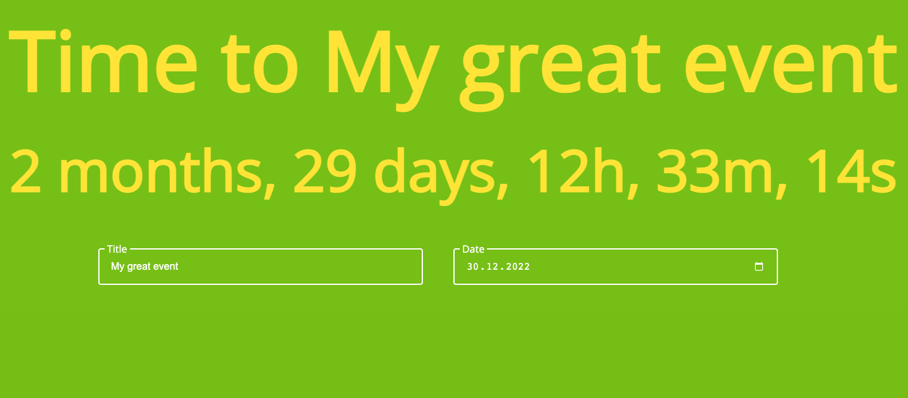

# Countdown app ⌛

You can set an event title and a date that you are waiting for.

For testing, check out [Netlify page](https://agatapst-countdown-app.netlify.app).

This project was generated with [Angular CLI](https://github.com/angular/angular-cli) version 14.2.4.

## Table of Contents

- General info
- Setup
- Available scripts
- Technologies

## General info

It is be possible to define the end date and the name of the event taking place on that day. The countdown should always start from the current time and it should display the
time remaining to your specified end date. The event name and the specified end date are persisted between page reloads.

## Setup

### Development server

Run `ng serve` for a dev server. Navigate to `http://localhost:4200/`. The application will automatically reload if you change any of the source files.

### Build

Run `ng build` to build the project. The build artifacts will be stored in the `dist/` directory.

### Running unit tests

Run `ng test` to execute the unit tests via [Karma](https://karma-runner.github.io).

### Further help

To get more help on the Angular CLI use `ng help` or go check out the [Angular CLI Overview and Command Reference](https://angular.io/cli) page.

## Technologies

- Angular 14.2.4
- Typescript 4.7.2
